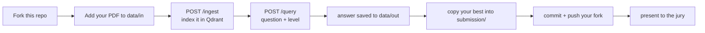

# The Fourth Turn - TEAM PTIE

A hackathon by the **[AI Multimedia Lab](https://aimultimedialab.ro/)** at
**[ESSIR 2026](https://2026.essir.eu/)** — the European Summer School in Information Retrieval,
Bucharest. In teams, over the week, you build a backend that **answers questions about a document
through a conversation** — and this repository is the scaffold you fork and build on.

It is an **open-source challenge**: any model you can host on your own machine (via Ollama, LM
Studio, or your own server) is fair game. No paid API required.

## Why "The Fourth Turn"

A question-answering system is easy to show off on a single, self-contained question and hard
to sustain across a conversation. The first turn of a dialogue stands on its own; each later turn
leans on what was already asked and answered. By the time a user reaches, say, the fourth turn —
*"and how does that compare to the previous method?"* — the question can only be understood in
light of the turns before it. It has almost nothing to search for on its own.

The challenge is built around that progression, in three levels:

1. **Retrieval** — answer a self-contained question, grounded in the document.
2. **Conversational memory** — answer a follow-up that depends on earlier turns.
3. **Whole-document reasoning** — answer questions no single passage contains.

The name marks the point where plain retrieval stops being enough and *context engineering* begins.

## What you do

**You choose your own document** — one open-access PDF you find interesting — and build a system
that answers nine questions about it (three per level, questions you write yourself).



The scaffold already runs a naive baseline; you improve it up the three levels. Deliver your
fork's URL, the nine answers, a technical note, and a Friday presentation.

## The stack

Python · FastAPI · `uv` · Docker · Qdrant. Backend only (a frontend is optional). Embeddings run
locally out of the box (sentence-transformers); the LLM works with **LM Studio** (default),
**Ollama**, or any hosted API via **litellm**.

## Quick start

```bash
# 1. Fork on GitHub, then clone your fork
git clone https://github.com/<your-team>/essir2026-aim-hackathon-participants.git
cd essir2026-aim-hackathon-participants

# 2. Create your .env from the example, then edit it (pick your provider + model)
cp .env.example .env

# 3. Put your chosen PDF in data/in/
cp ~/Downloads/your-document.pdf data/in/

# 4. Bring up the app + Qdrant  (unusual ports on purpose)
docker compose up --build
#    app     -> http://localhost:8791      (Swagger UI at /docs)
#    qdrant  -> http://localhost:6391      (dashboard at /dashboard)

# 5. Index your PDF, then ask a question (just question + level)
curl -s localhost:8791/ingest -H 'content-type: application/json' -d '{}'
curl -s localhost:8791/query  -H 'content-type: application/json' \
  -d '{"question": "What is this document about?", "level": 1}'
```

Prefer to run it without Docker?

```bash
uv sync
uv run uvicorn app.main:app --port 8791 --reload    # needs a reachable Qdrant + LLM
```

## Where things are

```
app/                 the FastAPI service you build on
├── main.py          app factory + Swagger
├── config.py        settings (.env)
├── models.py        request/response schemas — QueryResponse IS the graded format
├── llm/             LM Studio · Ollama · litellm interfaces (+ how to add your own)
├── vectorstore/     Qdrant wrapper (list / read / write)
└── rag/             chunking · embeddings · ingest · retrieve · memory · pipeline  <- the challenge
data/in/             put YOUR chosen PDF here (committed)
data/out/            every /query answer is written here (working scratch)
submission/          your team.json + the nine answers — the deliverable (level-1/2/3)
questions/           how to write your nine questions (recommendations)
templates/           the technical-note scaffold
postman/             a Postman/Bruno collection to drive the API by hand
ai_skill/            VALIDATE_SUBMISSION.md — an AI skill to check your submission
docs/                everything below, in depth
```

Everywhere worth improving is marked with a `TODO(level-N)` comment. The baseline has **no
chunking** and a **local embedding model** — those are the first things you'll want to improve.
Start in `app/rag/`.

## Read next (`docs/`)

1. [`01_overview.md`](docs/01_overview.md) — what you build and why it is complex.
2. [`02_timeline.md`](docs/02_timeline.md) — the week and every deadline.
3. [`03_tasks.md`](docs/03_tasks.md) — the three levels, and where each lives in the code.
4. [`04_rules.md`](docs/04_rules.md) — what is allowed, how teams work.
5. [`05_evaluation.md`](docs/05_evaluation.md) — how the score is put together (50% repo + 50% jury).
6. [`rubric.md`](docs/rubric.md) — the exact criteria your repository is assessed against.
7. [`06_submission.md`](docs/06_submission.md) — what to deliver and how to validate it.
8. [`07_hints.md`](docs/07_hints.md) — where the time actually goes.
9. [`08_advisor.md`](docs/08_advisor.md) — a ready-to-paste prompt that turns your favorite LLM
   into a strategy advisor for this challenge.
10. [`09_faq.md`](docs/09_faq.md) — common questions.
11. [`10_contact.md`](docs/10_contact.md) — how to reach the organisers.

## Before you push

Validate with the AI skill in [`ai_skill/VALIDATE_SUBMISSION.md`](ai_skill/VALIDATE_SUBMISSION.md)
— paste it into your AI coding tool and it checks your submission is complete. An empty or
malformed answer file scores 0 for that question.
